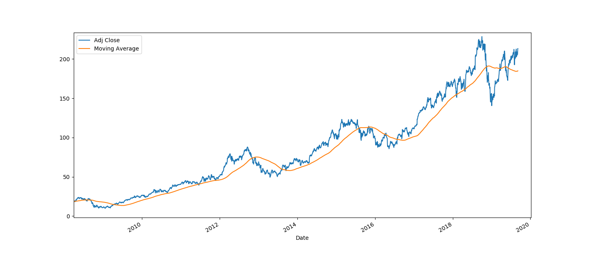

# Stock Price Prediction Evaluation

This project is indented to present a small evaluation of different types of regression models for predicting stock prices for [AAPL](https://finance.yahoo.com/quote/AAPL/history?p=AAPL).

## Setup

Steps:

- Download the repository
- Install packages: `pip install -r requirements.txt`
- Run: `python comparison.py`

## Evaluation

### Comparison

#### Models sorted by confidence

| Method | Confidence | Mean Absolute Error | Mean Squared Error | Root Mean Squared Error |
| :---: | ---: | ---: | ---: | ---: |
| Orthogonal Matching Pursuit | 99.9644% | 12.944 | 251.349 | 3.598 |
| Orthogonal Matching Pursuit CV | 99.9644% | 12.944 | 251.362 | 3.598 |
| Linear | 99.9641% | 12.898 | 249.516 | 3.591 |
| Bayesian Ridge | 99.9641% | 12.898 | 249.513 | 3.591 |
| Ridge CV | 99.9641% | 12.897 | 249.494 | 3.591 |
| Ridge | 99.9641% | 12.892 | 249.295 | 3.591 |
| Elastic Net CV | 99.9639% | 12.876 | 248.647 | 3.588 |
| Lasso | 99.9634% | 13.116 | 259.209 | 3.622 |
| KNN | 99.7029% | 13.293 | 254.76 | 3.646 |
| Elastic Net | 99.4877% | 12.879 | 218.512 | 3.589 |
| Kernel Ridge | 71.8265% | 40.886 | 1778.924 | 6.394 |

#### Models sorted by RMSE

| Method | Confidence | Mean Absolute Error | Mean Squared Error | Root Mean Squared Error |
| :---: | ---: | ---: | ---: | ---: |
| Elastic Net CV | 99.9639% | 12.876 | 248.647 | 3.588268 |
| Elastic Net | 99.4877% | 12.879 | 218.512 | 3.588714 |
| Ridge | 99.9641% | 12.892 | 249.295 | 3.590572 |
| Ridge CV | 99.9641% | 12.897 | 249.494 | 3.591279 |
| Bayesian Ridge | 99.9641% | 12.898 | 249.513 | 3.591345 |
| Linear | 99.9641% | 12.898 | 249.516 | 3.591357 |
| Orthogonal Matching Pursuit CV | 99.9644% | 12.944 | 251.362 | 3.597757 |
| Orthogonal Matching Pursuit | 99.9644% | 12.944 | 251.349 | 3.597776 |
| Lasso | 99.9634% | 13.116 | 259.209 | 3.621619 |
| KNN | 99.7029% | 13.293 | 254.76 | 3.646022 |
| Kernel Ridge | 71.8265% | 40.886 | 1778.924 | 6.394188 |

#### Moving Average for Adj Close

In the next paragraphs you can find predictions using selected methods.

Settings:
- Alpha: 0.1
- Number of iterations: 1000
- Alphas search: 0.0001, 0.0001, 0.001, 0.1
- Number of neighbors: 2

